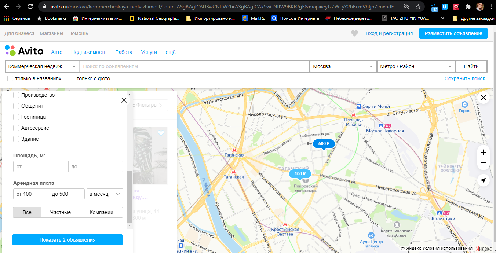
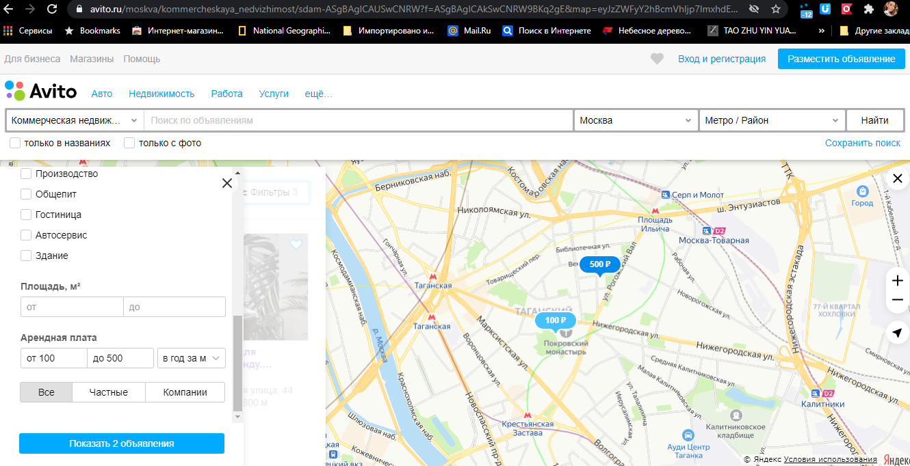
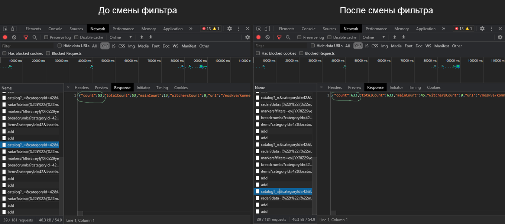
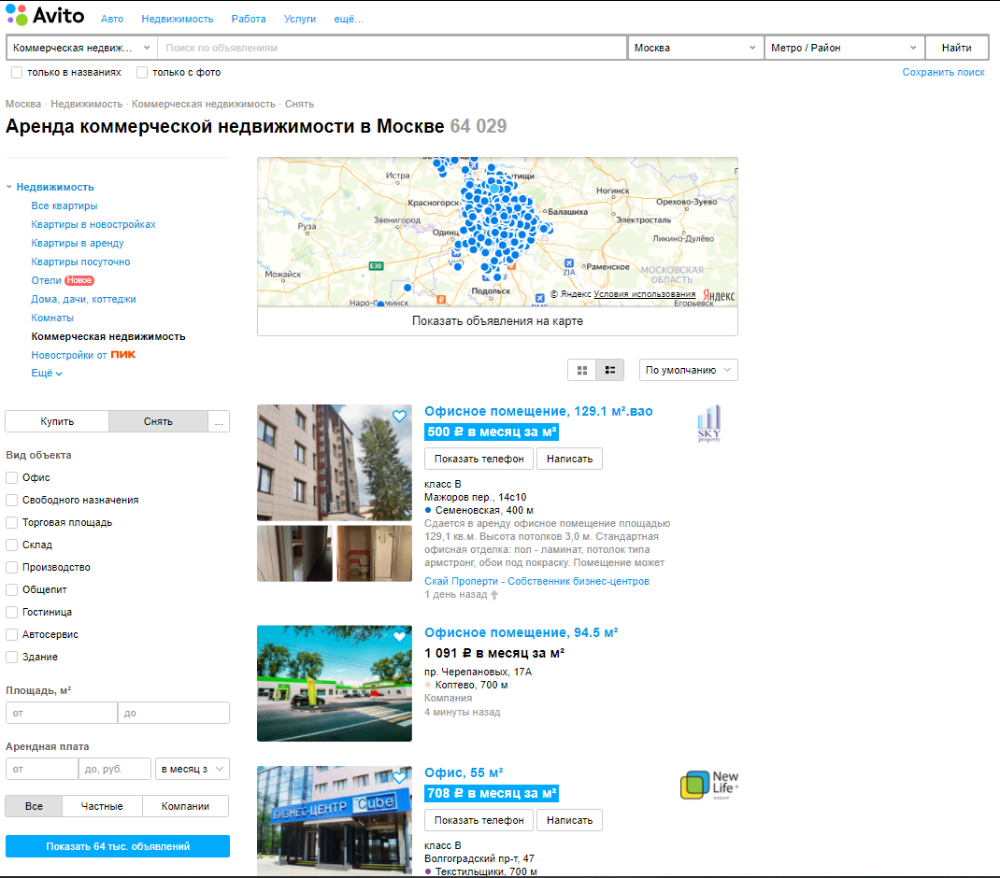
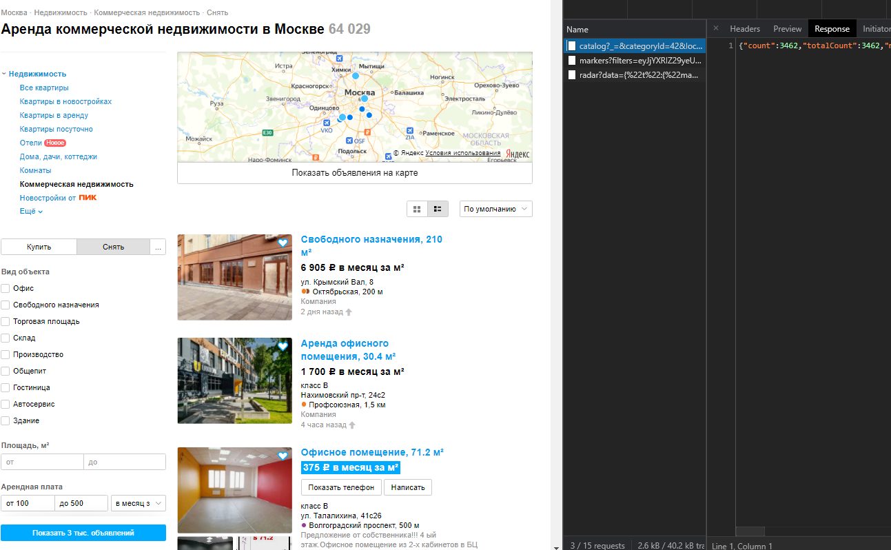

# Баг №1. (Это твой)  Не применяется фильтр типа Арендной платы на Яндекс.Картах для недвижимости.

## Среда: 

Win 10 (версия 1909), Google Chrome (Версия 88.0.4324.150), ноутбук Lenovo G580.

## Предусловия: -

## Шаги: 

1. Открыть раздел коммерческой недвижимости - https://www.avito.ru/moskva/kommercheskaya_nedvizhimost/
2. Нажать кнопку Снять в правом меню
3. Указать диапазон Арендной платы от 100 до 500 
4. Нажать Показать  
5. Нажать Показать обьявления на карте
6. Открыть Фильтры в правом меню
7. Сменить Тип арендной платы на В год за кв. м
8. Нажать Показать

## 4. Фактический результат:

1. Количество объявлений не изменилось
2. Тип арендной платы у объектов не изменился ни на карте, ни в списке справа
3. При смене на другой тип арендной платы тоже ничего не происходит визуально.
4. После шага 7 значение найденных помещений на кнопке не изменилось, но в запросе https://www.avito.ru/js/catalog пришло новое значение.

## 5. Ожидаемый результат:

1. Изменяется количество объявлений
2. Изменяется тип Арендной платы у объектов на выбранный
3. Значение на кнопке изменяется при изменении значений фильтра

## 6. Картинки:

До смены фильтра: 

После смены фильтра: 

Ответ на запрос /catalog во вкладке Network: 

## 7. Видео:

[https://drive.google.com/file/d/17lcY51yPFnJoS8w3rdiOrGdBbQSS7IzS/view?usp=sharing](https://drive.google.com/file/d/17lcY51yPFnJoS8w3rdiOrGdBbQSS7IzS/view?usp=sharing)

# Баг №0.  Не применяется фильтр Арендной платы для нестандарных типов цены в резделе недвижимости.

## Среда: 

Win 10 (версия 1909), Google Chrome (Версия 88.0.4324.150), ноутбук Lenovo G580.

## Предусловия: -

## Шаги: 

1. Открыть раздел коммерческой недвижимости - https://www.avito.ru/moskva/kommercheskaya_nedvizhimost/
2. Нажать кнопку Снять в правом меню
3. Выбрать Тип арендной платы В месяц за кв метр
4. Нажать Показать  
5. Указать диапазон цены от 100 до 500
6. Нажать Показать

## 4. Фактический результат:

1. Количество квартир не изменилось
2. В списке много квартир не подходящих под фильтр
3. Сбросились значения цены в фильтре
4. После шага 5 Значение найденных помещений на кнопке Показать изменилось на правильное (в запросе https://www.avito.ru/js/catalog пришло новое значение), но в поиске отобразилось значение без фильтра цены.

## 5. Ожидаемый результат:

1. Изменяется количество квартир, они подходят под фильтр
2. Значение на кнопке Показать приблезительно равно результату поиска (округлено вверх)
3. Не сбрасывается значение фильтра

## 6. Картинки:

До указания ценового диапазона: 
 

После: 

## 7. Видео:

[https://drive.google.com/file/d/15ox_BYGxAWMKBykhnWoqESDu9Bc53vbz/view?usp=sharing](https://drive.google.com/file/d/15ox_BYGxAWMKBykhnWoqESDu9Bc53vbz/view?usp=sharing)
