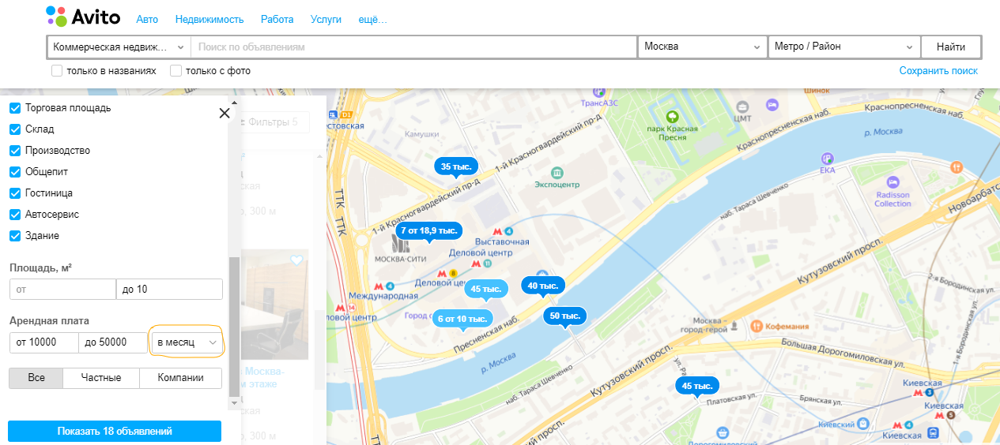
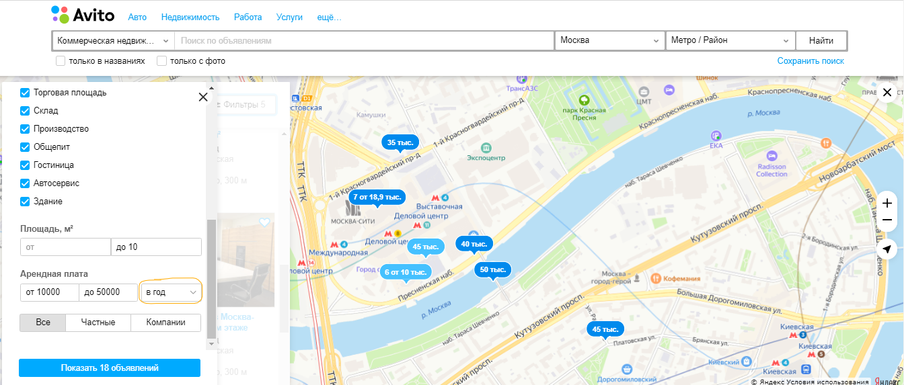

## Баг №1.  Не обновляется фильтр арендной платы с «в месяц» на «в месяц за м2», «в год» и т.д.

## 1. Среда: 
 Win 10, Google Chrome, ноутбук Lenovo G580.

## 2. Шаги: 

 - Не авторизовываться;
 - Раздел «Недвижимость»;
 - Раздел «Коммерческая недвижимость»;
 - Кнопка «Снять»;
 - В фильтрах отметить: все пункты «Вид объекта», Арендная плата (указать любой диапазон), в выпадающем списке выбрать «в месяц» и нажать кнопку «Показать», затем показать объявления на карте.

## 3. Воспроизведение бага.

Для воспроизведения бага поменять в выпадающем списке на «в месяц за м2», «в год», «в год за м2».

## 4. Фактический результат:

Пересчет арендной платы на квадратные метры или за год не производится.

## 5. Ожидаемый результат:

Производится пересчет арендной платы (за квадратные метры, в год и в год за квадратные метры), меняется число в объявлении, новые данные выводятся на карту.

## 6. Аттачи.

Видео: 
https://drive.google.com/file/d/1dwcJ06OLD-wYwY0TffH5HWuxiVvbzeFM/view?usp=sharing
