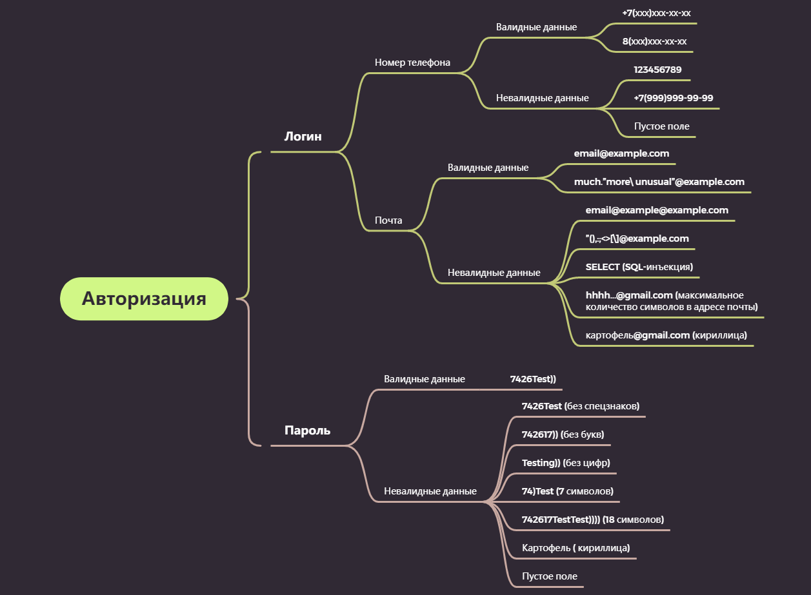

# Задача №3:"Составление набора тестовых данных для проверки авторизации"
Для составления валидных комбинаций тестовых данных был выбран действующий номер телефона существующего пользователя сайта [https://www.avito.ru](https://www.avito.ru), несуществующие, но корректные email и несуществующий, но корректный пароль.

Для удобства составления комбинаций тестовых данных, составила дерево классификаций.
## Дерево классификаций для авторизации на сайте [https://www.avito.ru](https://www.avito.ru)

## Тестовые данные:

| Логин | Пароль | Коментарии|
|-|-|-|
| +7(983)500-95-62 |7426Test))  |Валидные логин и пароль  |
| 8(983)500-95-62 |7426Test)) |Валидные логин и пароль |
| email@example.com |7426Test))  |Валидные логин и пароль  |
| much”more\unusual”@example.com |7426Test)) |Валидные логин и пароль  |
| 123456789 |7426Test))  |Невалидный логин (номер телефона состоит из 9 цифр вместо 11) и валидный пароль  |
| +7(999)999-99-99 |7426Test)) |Невалидный логин (несуществующий номер телефона) и валидный пароль  |
| Пустое поле |7426Test)) |Невалидный логин (нет данных) и валидный пароль  |
| email@example@example.com |7426Test))  |Невалидный логин (некорректный email) и валидный пароль  |
| ”(),:;<>[\]@example.com|7426Test)) |Невалидный логин (спец.символы в не существующем email) и валидный пароль  |
| SELECT (SQL-инъекция) |7426Test)) |Невалидный логин (вызов команды SELECT, попытка связи с базой данных) и валидный пароль  |
|hhhh...@gmail.com |7426Test)) |Невалидный логин (слишком длинный email) и валидный пароль  |
|картофель@gmail.com|7426Test)) |Невалидный логин (email, содержащий кириллицу) и валидный пароль  |
| 8(983)500-95-62| 7426Test  |Валидный логин и невалидный пароль (без спец.символов)|
| 8(983)500-95-62|742617)) |Валидный логин и невалидный пароль (без букв) |
|8(983)500-95-62 | Testing)) |Валидный логин и невалидный пароль (без цифр) |
|8(983)500-95-62| 74)Test |Валидный логин и невалидный пароль (короткий пароль. 7 символов) |
|8(983)500-95-62| 742617TestTest)))) |Валидный логин и невалидный пароль  (длинный пароль. 18 символов)|
|8(983)500-95-62| Картофель |Валидный логин и невалидный пароль (содержащий кириллицу)|
|8(983)500-95-62| Пустое поле |Валидный логин и невалидный пароль  (нет данных)|